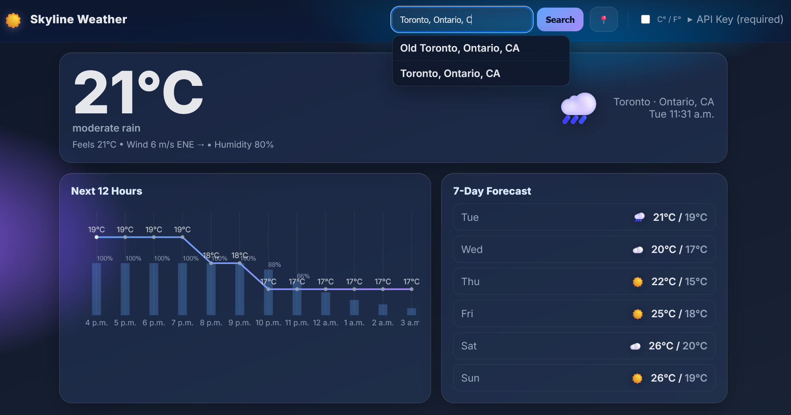

Skyline Weather
================

A modern, reactive weather web app with animated visuals (clear, clouds, drizzle, rain, snow, thunder, fog/haze). Built with plain HTML/CSS/JS — no build step.

Features
--------
- Animated backgrounds that respond to conditions (2xx/3xx/5xx/6xx/7xx/800/80x)
- Current conditions card with wind direction arrow and optional UV index
- Hourly chart (next 12 hours) with temperature line and precipitation probability overlay
- 7‑day forecast list with smooth item animations
- Geolocation, city search, units toggle (metric/imperial), and OpenWeatherMap live data
 - City suggestions dropdown via OpenWeatherMap geocoding

Requirements
------------
- Any static HTTP server (e.g., Python 3’s built‑in server)
- A modern browser (ES modules, canvas). No build tools required
- OpenWeatherMap API key (required)

Quick Start
-----------
1. Serve statically to avoid CORS.
   - Python: `python3 -m http.server 5173` and open http://localhost:5173/
2. Enter your OpenWeatherMap API key in the header (API Key) panel.
3. Search for a city or click the geolocation button. Toggle units anytime.

Configuration
-------------
- API Key: Stored in `localStorage` as `owm_api_key` and used for all requests.
- Units: Toggle C°/F°; the app refetches with the selected units.

Controls & Behavior
-------------------
- Search: Type a city name and press Enter
- Geolocate: Uses the browser’s geolocation API if permitted
- Units: Toggle C°/F°. With a key set, data is refetched in the chosen units

Live Data (OpenWeatherMap)
--------------------------
- Geocoding: `https://api.openweathermap.org/geo/1.0/direct?q={city}&limit=1&appid={key}`
- One Call v3.0: `https://api.openweathermap.org/data/3.0/onecall?lat={lat}&lon={lon}&units={units}&appid={key}`
- Units: `metric` (°C, m/s) or `imperial` (°F, mph)
- If One Call 3.0 is unavailable for your plan, adapt `assets/js/weather.js` to use Current + 5‑day (3h) endpoints.

Project Structure
-----------------
- `index.html` — App shell and markup
- `assets/css/styles.css` — Styles and layout (glassmorphism + responsive rules)
- `assets/js/app.js` — UI state, event wiring, rendering, and chart drawing
- `assets/js/weather.js` — Weather data access and formatting (OWM only; API key required)
- `assets/js/animations.js` — Fullscreen canvas animations mapped from condition codes

Recent Additions
----------------
- Fog/Haze ambient layer for 7xx codes
- Precipitation probability (POP) overlay on the hourly chart
- UV index on the current card (when available)
- Animated forecast list items on new searches
 - City autocomplete suggestions beneath the search bar

Troubleshooting
---------------
- Opening via `file://` may block requests → Serve via localhost as shown above
- No live data after entering a key → Verify the key and your plan’s access to One Call v3.0
- Geolocation denied/unavailable → Use the search box

Testing Checklist
-----------------
- Without an API key the UI prompts for a key; no fetch occurs
- Enter a city + API key → live data loads; background effects match conditions
- Toggle units → values update and the app refetches
- Resize window → hourly chart resizes and redraws

License
-------
For demo and educational purposes. See `AGENTS.md` for technical notes and roadmap.
